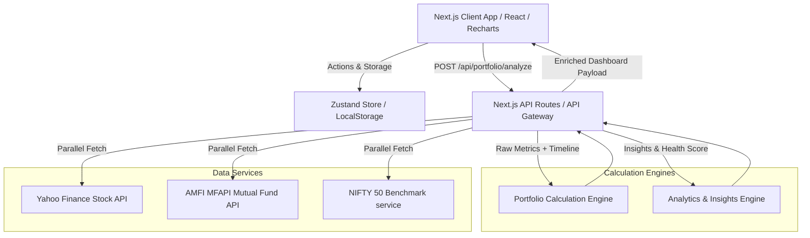

# MarketPulse System Design & Architecture

MarketPulse is a high-performance Indian portfolio simulator that allows users to mock holdings across NSE stocks and mutual funds, fetching live quotes and computing historical performance against the **NIFTY 50** benchmark.

---

## 🎨 System Design Diagram

---

## 🏗️ Architectural Overview

The system is organized into a modular layered architecture:

---

## 💾 Component Breakdown

### 1. Presentation & State Layer (Client-Side)
- **Framework**: Next.js App Router.
- **Client State**: Zustand-based store (`usePortfolioStore.ts`) that persists holding details (Instrument ID, quantity, purchase price, date) locally via browser storage.
- **Charts (Recharts)**:
  - `PortfolioVsBenchmarkChart`: Renders a 1-year historical line comparison of overall Portfolio Value vs. Invested Value vs. NIFTY 50.
  - `AllocationDonut`: Visualizes portfolio asset allocation by sector/category weight.
  - `PerformanceBarChart`: Displays individual returns of stocks/funds.

### 2. API / Orchestration Layer
- **`POST /api/portfolio/analyze`**:
  - Main gateway orchestrating the workflow.
  - Triggers data acquisition in parallel using `Promise.all` for optimal performance.
  - Feeds returned datasets to the Calculation Engines.

### 3. Data Integration Services
- **Stock Service (`stockService.ts`)**: Fetches NSE stock prices and historical quotes via Yahoo Finance.
- **Mutual Fund Service (`mutualFundService.ts`)**: Connects to the public AMFI database (`api.mfapi.in`) to fetch Net Asset Values (NAV).
- **Benchmark Service (`benchmarkService.ts`)**: Fetches NIFTY 50 historical data as the baseline comparison.

### 4. Calculation & Processing Engines
- **Portfolio Calculation Engine (`portfolioEngine.ts`)**:
  - Sets up the relative weighting of each holding.
  - Generates a historical portfolio valuation timeline.
  - Implements **LOCF (Last Observation Carried Forward)** to align weekends/holidays data where mutual funds or stocks lack quotes.
- **Analytics Engine (`analyticsEngine.ts`)**:
  - **Portfolio Health Score**: Calculated using metrics like diversification, benchmark outperformance, and allocation risk.
  - **Dynamic Insights**: Automatically checks thresholds to issue custom alerts (e.g., sector concentration warnings, underperforming assets).
