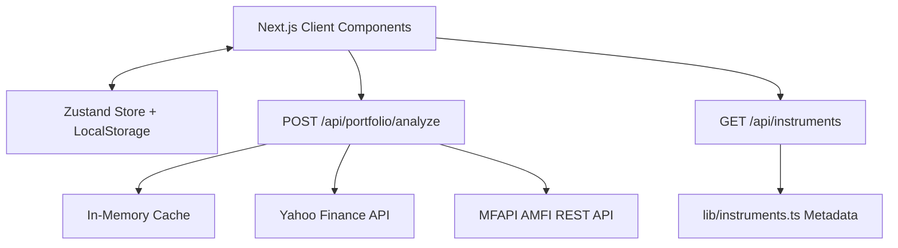

# MarketPulse Technical System Notes

This document contains internal technical references, API contracts, caching policies, and algorithmic implementations for the MarketPulse Portfolio Simulator.

---

## 1. System Architecture overview


---

## 2. API Endpoints & Data Contracts

### 2.1 GET `/api/instruments`
Retrieves a filtered list of all predefined NSE equities and AMFI mutual funds supported by the system.
* **Query Parameters**:
  * `q` (string, optional): Search query to match name, symbol, or sector/category.
* **Response Payload (`200 OK`)**:
  ```json
  [
    {
      "id": "reliance",
      "symbol": "RELIANCE.NS",
      "name": "Reliance Industries Limited",
      "shortName": "Reliance",
      "type": "stock",
      "sector": "Energy & Petrochemicals",
      "source": "yahoo_finance"
    },
    {
      "id": "sbi-bluechip",
      "symbol": "120847",
      "name": "SBI Bluechip Fund - Direct Plan - Growth",
      "shortName": "SBI Bluechip",
      "type": "mutual_fund",
      "category": "Equity - Large Cap",
      "source": "mfapi"
    }
  ]
  ```

### 2.2 POST `/api/portfolio/analyze`
Accepts user portfolio positions and performs historical return alignment, index benchmarking, and metadata calculations.
* **Request Payload**:
  ```json
  {
    "holdings": [
      {
        "id": "pos_01",
        "instrumentId": "reliance",
        "quantity": 10,
        "purchasePrice": 2400.0,
        "purchaseDate": "2025-01-15"
      }
    ]
  }
  ```
* **Response Payload (`200 OK`)**:
  ```json
  {
    "summary": {
      "totalInvested": 24000.0,
      "currentValue": 25800.0,
      "totalGainLoss": 1800.0,
      "totalGainLossPercent": 7.5,
      "benchmarkReturn": 5.2,
      "outperformance": 2.3
    },
    "metrics": [
      {
        "holdingId": "pos_01",
        "instrumentId": "reliance",
        "name": "Reliance Industries Limited",
        "symbol": "RELIANCE.NS",
        "type": "stock",
        "quantity": 10,
        "purchasePrice": 2400.0,
        "currentPrice": 2580.0,
        "investedValue": 24000.0,
        "currentValue": 25800.0,
        "gainLoss": 1800.0,
        "gainLossPercent": 7.5
      }
    ],
    "timeline": [
      {
        "date": "2025-01-15",
        "portfolioValue": 24000.0,
        "investedValue": 24000.0,
        "benchmarkValue": 24000.0
      }
    ],
    "allocation": [
      { "name": "Reliance", "value": 25800.0, "percentage": 100.0 }
    ],
    "performanceBars": [
      { "name": "Reliance", "return": 7.5 }
    ],
    "healthScore": 85,
    "sources": {
      "yahoo_finance": "OK",
      "mfapi": "OK"
    },
    "fetchedAt": "2026-07-16T02:58:00.000Z"
  }
  ```

---

## 3. Algorithmic Solutions

### 3.1 LOCF (Last Observation Carried Forward)
To handle discrepancies in data reporting days (weekends, market holidays, or offset mutual fund NAV declarations), we construct a daily unified timeline from the earliest transaction date to today.
1. Create a set of all unique calendar dates.
2. For each asset, match available historical prices to the calendar dates.
3. If a price point is missing for date $T$:
   $$\text{Price}(T) = \text{Price}(T-1)$$
4. Iterate forward until the timeline is fully populated, guaranteeing a seamless series for the 1-Year benchmark chart.

### 3.2 Indian Currency Formatting (INR)
Standard Western millions/billions are suppressed in favor of Indian Rupee formatting conventions:
* Values $\ge 1,00,00,000$ are represented in **Crores (Cr)**.
* Values $\ge 1,00,00,000$ but $< 1,00,00,000$ are formatted in **Lakhs (L)**. (Actually Lakhs is >= 1,00,000)
* Standard localized groupings are applied (`₹12,34,567.89`).

---

## 4. Cache Management Policies
To prevent hitting API rate limits on third-party endpoints, Next.js route handlers implement an in-memory cache layer (`src/lib/cache.ts`):

| Target Feed | Source | Cache TTL | Storage |
| :--- | :--- | :--- | :--- |
| **Stocks & Indices** | Yahoo Finance | **5 Minutes** | Node.js Server RAM Cache |
| **Mutual Fund NAVs** | MFAPI | **24 Hours** | Node.js Server RAM Cache |

*Note: The cache key is generated from a composite hash of the instrument identifier and the date range requested.*

---

## 5. Security & Persistence Boundaries
1. **Client Isolation**: No user positions, transaction dates, or quantities are sent to a cloud database. All portfolio states are persisted inside the browser client's local storage (`localStorage`).
2. **Public API Proxying**: External queries are routed through Next.js proxy route handlers (`/api/portfolio/analyze`). This hides browser agent details from target APIs and prevents CORS issues.
