# MarketPulse Core Workflows

This document describes the end-to-end logical flow and background operations of the MarketPulse Portfolio Simulator.

---

## 🔄 User & Data Flow Diagram

```mermaid
sequenceDiagram
    actor User
    participant Client as Client (Zustand & UI)
    participant API as Next.js API Route
    participant ThirdParty as Yahoo Finance / MFAPI

    User->>Client: Add holding (Instrument, Qty, Buy Price, Date)
    Client->>Client: Save holding to Zustand Store & LocalStorage
    Client->>Client: Route redirect to Dashboard ("/")
    Client->>API: POST /api/portfolio/analyze (Send holdings list)
    
    rect rgb(30, 41, 59)
        note right of API: Concurrent Data Fetching
        API->>ThirdParty: Fetch Benchmark (NIFTY 50) history
        API->>ThirdParty: Fetch Stock/MF histories in parallel
        ThirdParty-->>API: Return historical prices (last 365 days)
    end

    rect rgb(15, 23, 42)
        note right of API: Calculations & LOCF Alignment
        API->>API: Apply LOCF to align holiday/weekend price gaps
        API->>API: Compute individual asset metrics & weights
        API->>API: Build continuous 1-year valuation timeline
        API->>API: Generate insights and portfolio health score
    end

    API-->>Client: Return enriched dashboard payload
    Client->>User: Render charts (Recharts) and Position Tables
```

---

## 📈 Detailed Step-by-Step Breakdown

### 1. Adding a Position
1. The user navigates to the `/add` page.
2. The user searches for a stock or mutual fund using the auto-suggest lookup input.
3. The user enters **Quantity**, **Purchase Price**, and the **Purchase Date** (must be today or in the past).
4. Upon clicking "Add to Portfolio", the position is saved to the local Zustand state and stored in the browser's `localStorage`.
5. The application triggers a client-side route redirection back to the dashboard.

### 2. Loading and Hydrating the Dashboard
1. The dashboard page detects the initialized Zustand holdings.
2. A payload of user holdings is POSTed to `/api/portfolio/analyze`.
3. If no holdings exist, the empty state screen is shown.
4. If holdings exist, a loading state is rendered while market data fetches in the background.

### 3. Data Fetching & Parallel Processing
1. The API route receives the list of holdings.
2. The route extracts the earliest purchase date among all holdings to optimize benchmark query ranges.
3. It launches asynchronous quote requests in parallel:
   - For stocks: Current and 1-year historical pricing from Yahoo Finance.
   - For mutual funds: Current NAV and historical scheme details from MFAPI.
   - For benchmark: NIFTY 50 (`^NSEI`) history for the past 365 days.

### 4. Data Alignment using LOCF (Last Observation Carried Forward)
- Mutual funds are only valued on Business Days (AMFI releases NAVs Mon-Fri). Stocks are not traded on weekends or stock exchange holidays.
- To compute combined portfolio value day-by-day, pricing vectors must align.
- **LOCF logic**: For any date in the 365-day timeline lacking a record for a specific asset, the system carries forward the last available closing price/NAV.
- This creates a continuous daily timeline, preventing charts from dipping to zero on weekends or holidays.

### 5. Metric Calculations
1. **Purchase Value** = Quantity × Purchase Price.
2. **Current Value** = Quantity × Latest Market Price.
3. **Absolute Return** = Current Value − Purchase Value.
4. **Percentage Return** = (Absolute Return / Purchase Value) × 100.
5. **Asset Weight** = Asset Current Value / Total Portfolio Value.
6. **Benchmark Return** = Percentage growth of NIFTY 50 index from the earliest purchase date to the current date.
7. **Outperformance** = Portfolio Overall Return % − Benchmark Return %.

### 6. Analytics & Health Review
1. The system checks individual asset allocation weights to warn if any single security represents over 35% of the total portfolio (diversification alert).
2. It evaluates cash/fund balance and details recommendations.
3. A health score out of 100 is generated based on:
   - Benchmark outperformance (weight: 40%)
   - Sector/Asset diversification (weight: 40%)
   - Overall gain status (weight: 20%)
